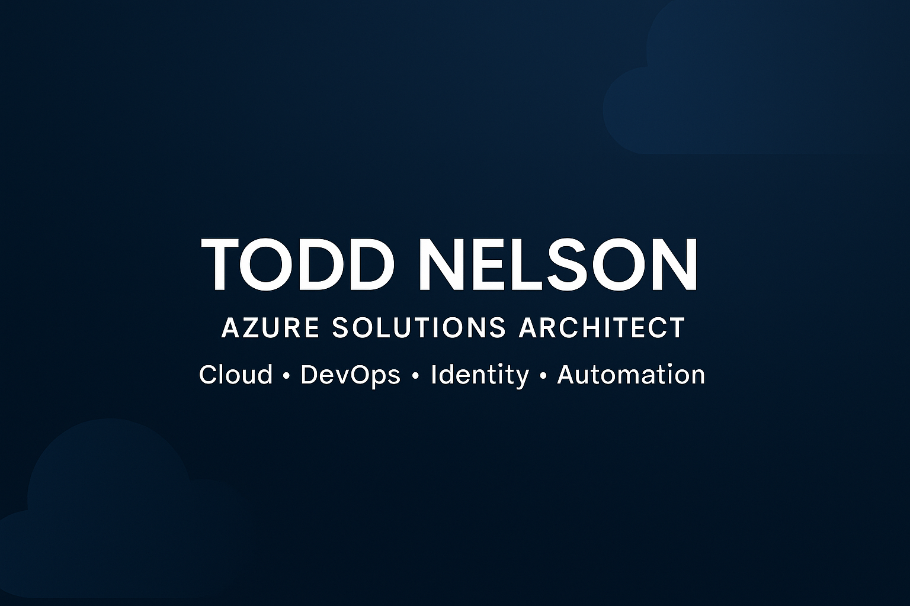
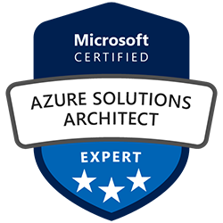
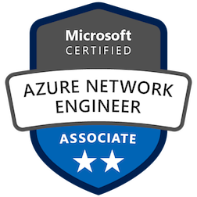
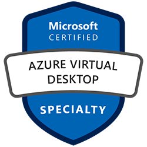
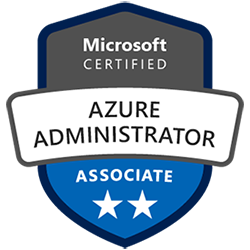

  

# Hi, I'm Todd Nelson 👋  
### Azure Solutions Architect • Cloud Infrastructure • DevOps & Automation

I design and build secure, scalable cloud architectures using Microsoft Azure.  
My work focuses on automation, Infrastructure as Code, identity, networking,  
and enterprise DevOps practices.

---

## 🧩 Core Skills

### ☁️ Cloud & Identity
- Azure Architecture & Governance  
- Entra ID / Azure AD B2C (custom policies, SSO, API protection)  
- Networking, Security, Storage, Compute  
- Multi-environment enterprise deployments

### 🛠 Infrastructure as Code
- **Bicep (primary)**  
- ARM Templates  
- Terraform (expanding)

### 💻 Languages & Automation
- PowerShell  
- Python  
- C# (currently learning)

### 🚀 DevOps & Tooling
- Azure DevOps  
- Git & GitHub  
- CI/CD pipelines  
- Docker fundamentals  

---

## 🏆 Certifications

  
  
  
  
  

Currently working toward: **Azure DevOps Engineer Expert**

---

## 📌 Featured Projects

| Project | Description |
|--------|-------------|
| **Enterprise Bicep Modules** | Modular, repeatable patterns for secure Azure deployments |
| **Azure B2C Custom Policies** | Identity flows including SSO, ROPC, and API protection |
| **Terraform Multi-Cloud Lab** | Experiments deploying similar architecture across Azure & AWS |
| **Automation Toolkit** | PowerShell + Python scripts for cloud operations |

*(I’ll link repos here as they become public.)*

---

## 🔭 What I'm Working On
- Large-scale Bicep-driven enterprise architectures  
- Advancing Terraform and Python for automation  
- Custom B2C identity flows for API authentication  
- DevOps pipeline improvements (Azure DevOps & GitHub)  
- Deepening C# knowledge for Azure Functions  

---

## 📈 GitHub Activity

  

---

## 📫 Connect

[LinkedIn](https://linkedin.com/in/toddnelson5)

